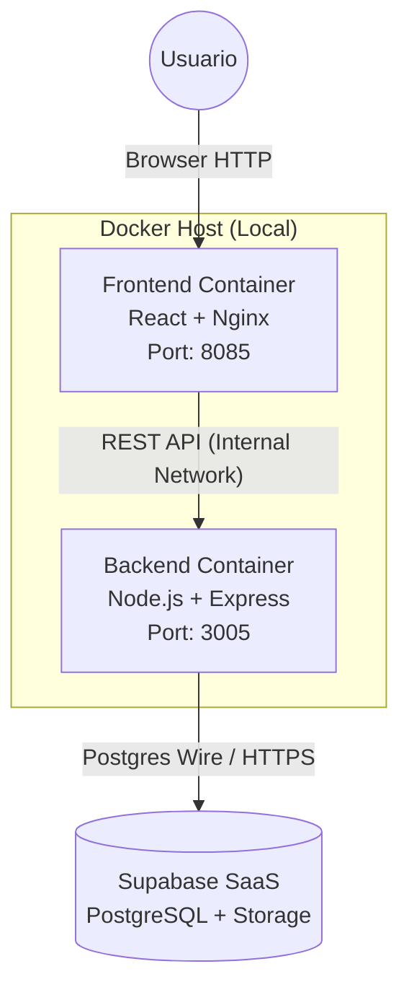
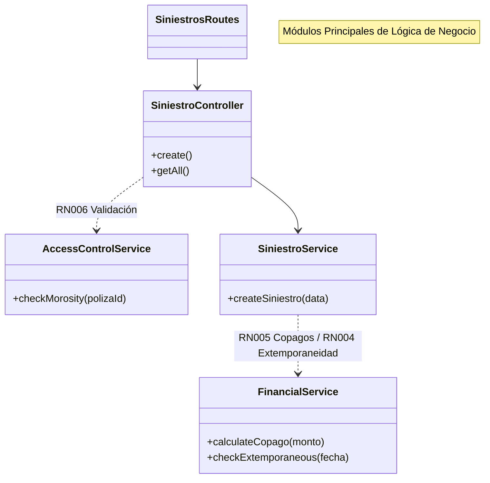
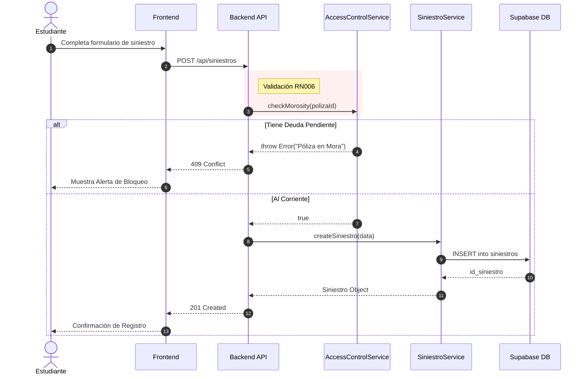

# Sistema de Gestión de Pólizas de Seguros - UTPL

> **Estado del Proyecto**: Sprint 2 Completado (Propuesta B1). Incluye Arquitectura, Siniestros, Lógica Financiera, Renovaciones y Control de Acceso.

Este sistema gestiona el ciclo de vida completo de pólizas de seguros de vida estudiantil, incorporando las reglas de negocio específicas de la UTPL (Propuesta B1) para el manejo de copagos, vigencias, morosidad y reportes de nómina.

## 🚀 Despliegue Rápido (Docker)

El proyecto está contenerizado para una ejecución inmediata:

```bash
docker-compose up --build -d
```

*   **Frontend (Backoffice)**: [http://localhost:8085](http://localhost:8085)
*   **Backend (API)**: [http://localhost:3005](http://localhost:3005)

---

## 🏗 Arquitectura del Sistema

Implementamos una arquitectura **3-Tier** robusta:

1.  **Frontend (Presentación)**: React + Vite + TailwindCSS.
    *   Consumo de API centralizado y seguro.
    *   Diseño responsivo y amigable.
2.  **Backend (Lógica de Negocio)**: Node.js + Express.
    *   Controladores modulares (Pagos, Siniestros, Pólizas).
    *   Servicios de Dominio (`FinancialService`, `RenewalService`, `AccessControlService`).
    *   Seguridad RBAC y logs de auditoría.
3.  **Datos (Persistencia)**: PostgreSQL (Supabase).
    *   Esquema normalizado con reglas de integridad.
    *   Storage para evidencias documentales (S3-compatible).

---

## ✨ Funcionalidades "Propuesta B1" (Nuevo)

Hemos implementado el 100% de los requerimientos de la Propuesta B1 para alinear el sistema con la realidad financiera de la UTPL.

### 1. Gestión Financiera Avanzada (Pagos)
*   **Cálculo de Copagos (70/30)**: `FinancialService` divide automáticamente cada pago:
    *   **Institución (70%)** - **Empleado (30%)** (Configurable).
    *   Visible en el Dashboard Financiero.
*   **Extemporaneidad (Regla del Día 15)**:
    *   Pagos registrados después del día 15 del mes se marcan automáticamente como `EXTEMPORANEO`.
    *   Pagos antes del día 15 son `ORDINARIO`.
*   **Reporte de Nómina**: Endpoint especializado (`/api/pagos/reporte-nomina`) para generar el corte de descuentos.

### 2. Control de Acceso y Morosidad (Siniestros)
*   **Validación Estricta (RN006)**: Implementada en `AccessControlService`.
    *   **Bloqueo**: El sistema **rechaza** el registro de siniestros si la póliza tiene deudas pendientes.
    *   Error `409 Conflict` con mensaje explicativo para el usuario.
*   **FSM (Máquina de Estados)**: Transiciones controladas y auditadas para el ciclo de vida del siniestro.

### 3. Servicio de Renovación Anual (RN001)
*   **RenewalService**: Automatiza el cierre de año fiscal.
    *   Clona pólizas activas del año anterior (`2025`) al nuevo periodo (`2026`).
    *   Genera nuevos números de póliza (`REN-2026-XXXX`).

### 4. Dashboard Financiero
*   Vista global (`/api/pagos/todos`) para el Rol Financiero, permitiendo auditar el estado de todos los aportes.

---

## ✅ Funcionalidades Base (Sprint 1)

Mantenemos y potenciamos las funcionalidades core originales:

*   **Autenticación**: Login seguro (JWT), gestión de sesiones y perfiles.
*   **Gestión Documental**: Carga de evidencias PDF con validación de hash SHA-256.
*   **Vigencias**: Control de periodos abiertos/cerrados para permitir o bloquear operaciones.

---

## 📜 Reglas de Negocio Integradas

| ID | Regla | Estado | Implementación Técnica |
| :--- | :--- | :--- | :--- |
| **RN001** | **Renovación Anual** | ✅ Implementado | `RenewalService`. |
| **RN004** | **Corte Día 15** | ✅ Implementado | `FinancialService.isExtemporaneous`. |
| **RN005** | **Copagos (70/30)** | ✅ Implementado | `FinancialService.calculateCopago`. |
| **RN006** | **Bloqueo Morosidad** | ✅ Implementado | `AccessControlService.checkMorosity`. |
| **RN010** | **Sesión Única** | ✅ Implementado | Tabla `sesiones` e invalidación activa. |

---

## 🛠 Verificación y Pruebas

Para validar las nuevas funcionalidades, consulta la guía detallada:

👉 **[Guía de Verificación (verification_guide.md)](verification_guide.md)**

### Comandos de Desarrollo Manual

**Backend:**
```bash
cd backend
npm install
npm run dev
```

**Frontend:**
```bash
cd frontend
npm install
npm run dev
```

---

**Autor**: Equipo de Desarrollo UTPL
**Versión**: 2.0.0 (Propuesta B1 Completa)

---

## 📐 Diagramas de Arquitectura

### 1. Arquitectura del Sistema (Contenedores)



### 2. Diagrama de Componentes (Backend Core)



### 3. Diagrama de Secuencia (Flujo Crítico: Registro de Siniestro)


